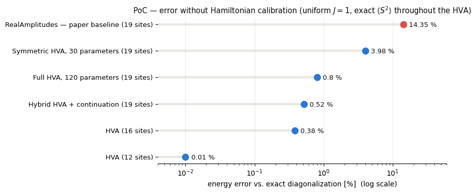

# Proof-of-Concept: Heisenberg-gate layers toward a Quantum Spin Liquid, *without* Hamiltonian calibration

## The idea

The paper compensates for the low expressiveness of a hardware-efficient `RealAmplitudes` ansatz by calibrating the Hamiltonian ($J \to J' \approx 2$ on
the defect triangles). This PoC tests the opposite route: an ansatz built from Heisenberg (eSWAP) gates $U_H(\theta)=e^{-i\theta(XX+YY+ZZ)/4}$, which commute with $S^2_{\text{total}}$ and therefore stay in the correct spin sector by construction; no calibration needed ($J=1$ uniform throughout).

## Key results

| System | Ansatz | Best energy error | $\langle S^2\rangle$ |
|---|---|---|---|
| 19 sites (odd → doublet) | `RealAmplitudes` baseline | 14.4 % | 2.18 (SU(2) broken) |
| 19 sites | **HVA, hybrid two-phase** | **0.52 %** | 0.75 exact at every depth |
| 12 sites (even → singlet) | **HVA** | **0.01 %** (fidelity 0.998) | 0.00 exact |
| 16 sites (even) | **HVA** | 0.38 % | 0.00 exact |

Beyond the energy (all vs. exact diagonalization): on 12 sites the ansatz reproduces all pair correlations at RMS 0.005 (14× better than static dimers); on 19 sites the 0.52 % state builds ~88 % of the ground state's entanglement entropy and has **F = 0.41** overlap with the (degenerate doublet) ground-state subspace.

## Method highlights

- **Adjoint (backprop-style) analytic gradient** for the HVA on a fast tensor-contraction statevector engine — the full gradient at ~3× the cost of one energy evaluation. This is what breaks the optimization plateau (COBYLA stalls at ~4 %).
- **Two-phase hybrid recipe** (the PoC's methodological contribution): explore cheaply with a *symmetric* HVA (one θ per edge-color class, ~5 params/layer), expand the solution to per-bond parameters (identical state, freer parametrization), then refine with the full HVA. Strictly better than a full sweep at equal compute budget.
- **MPS scaling with an honest double-χ protocol** (optimize at χ=64, quote at χ=128): reaches 26–47 sites, establishes the defect-triangle gap baselines, and *measures* where Aer-MPS stops being faithful (deep circuits at 47 qubits). The notebook's debugging notes document every failure mode found and the evidence used to fix or rule out each candidate solution.

## Repository layout

| Path | Contents |
|---|---|
| `PoC_Heisenberg_layers_QSL.ipynb` | The full study — self-contained report, all outputs and figures embedded |
| `kagome_hva.py` | Heisenberg gate, $S^2$ operator, fast statevector engine, adjoint gradient, sweeps, symmetric/hybrid variants, persistence, correlation/entropy analysis |
| `kagome_mps.py` | Star-chain lattice family generator (12–47 sites), MPS energy evaluator, symmetric sweep with monotonicity guarantee |
| `files/kagome_common.py` | Earlier reproduction of the paper's calibrated-Hamiltonian baseline (used as experimental control) |
| `results/*.npz` | Persisted optimal parameter vectors (the notebook auto-loads them, so analysis cells run without re-optimizing) |
| `figures/` | Exported summary figure |

## Requirements & running

Python ≥ 3.12 with `qiskit>=2.0` (tested on 2.3.0), `qiskit-aer` 0.17, `qiskit-algorithms`,`scipy`, `numpy`, `networkx`, `matplotlib`.

The notebook is fully deterministic (fixed seeds) and self-contained: a top-to-bottom **Run All takes ~3.5–4 h** on a laptop (8 GB RAM is enough, but run the kernel alone; the 19-qubit cells use ~1 GB and the sweeps are CPU-heavy). Thanks to the persisted optima in `results/`, the analysis cells (Sec. 4.6) can also be run directly after executing only the two setup cells at the top.

